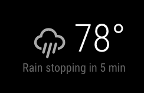

# MMM-Forecast-IO
This an extension for [MagicMirror](https://github.com/MichMich/MagicMirror) that adds localized weather using the [Dark Sky API](https://darksky.net/dev/) (originally Forecast.io) -- the same service that powers the [Dark Sky App](https://darksky.net/app/).

This module makes use of the [geolocation API](https://developer.mozilla.org/en-US/docs/Web/API/Geolocation/Using_geolocation) to determine the location of the mirror. This can be turned off by setting `latitude` and `longitude` in the module's config (see [Configuration options below](#configuration-options)).

Unless running headless in a browser, Geolocation requires setting the [GOOGLE_API_KEY environment variable](https://github.com/electron/electron/blob/master/docs/api/environment-variables.md#google_api_key).



## Using the module

To use this module, add it to the modules array in the `config/config.js` file:
````javascript
modules: [
  {
    module: 'MMM-forecast-io',
    position: 'top_right',  // This can be any of the regions.
    config: {
      // See 'Configuration options' for more information.
      apiKey: 'abcde12345abcde12345abcde12345ab', // Dark Sky API key.
      // Only required if geolocation doesn't work:
      latitude:   16.77532,
      longitude: -3.008265
    }
  }
]
````

## Configuration options

<table width="100%">
  <!-- why, markdown... -->
  <thead>
    <tr>
      <th>Option</th>
      <th width="100%">Description</th>
    </tr>
  <thead>
  <tbody>
    <tr>
      <td><code>apiKey</code></td>
      <td>The <a href="https://darksky.net/dev/" target="_blank">Dark Sky API</a> key, which can be obtained by creating an Dark Sky API account.<br>
        <br> This value is <b>REQUIRED</b>
      </td>
    </tr>
    <tr>
      <td><code>units</code></td>
      <td>What units to use. Specified by config.js<br>
        <br><b>Possible values:</b> <code>config.units</code> = Specified by config.js, <code>default</code> = Kelvin, <code>metric</code> = Celsius, <code>imperial</code> =Fahrenheit
        <br><b>Default value:</b> <code>config.units</code>
      </td>
    </tr>
    <tr>
      <td><code>language</code></td>
      <td>The language of the weather text.<br>
        <br><b>Possible values:</b> <code>en</code>, <code>nl</code>, <code>ru</code>, etc ...
        <br><b>Default value:</b> uses value of <i>config.language</i>
      </td>
    </tr>
    <tr>
      <td><code>updateInterval</code></td>
      <td>How often does the content needs to be fetched? (Milliseconds)<br>
        <br>Forecast.io enforces a 1,000/day request limit, so if you run your mirror constantly, anything below 90,000 (every 1.5 minutes) may require payment information or be blocked.<br>
        <br><b>Possible values:</b> <code>1000</code> - <code>86400000</code>
        <br><b>Default value:</b> <code>300000</code> (5 minutes)
      </td>
    </tr>
    <tr>
      <td><code>animationSpeed</code></td>
      <td>Speed of the update animation. (Milliseconds)<br>
        <br><b>Possible values:</b><code>0</code> - <code>5000</code>
        <br><b>Default value:</b> <code>2000</code> (2 seconds)
      </td>
    </tr>
    <tr>
      <td><code>initialLoadDelay</code></td>
      <td>The initial delay before loading. If you have multiple modules that use the same API key, you might want to delay one of the requests. (Milliseconds)<br>
        <br><b>Possible values:</b> <code>1000</code> - <code>5000</code>
        <br><b>Default value:</b>  <code>0</code>
      </td>
    </tr>
    <tr>
      <td><code>retryDelay</code></td>
      <td>The delay before retrying after a request failure. (Milliseconds)<br>
        <br><b>Possible values:</b> <code>1000</code> - <code>60000</code>
        <br><b>Default value:</b>  <code>2500</code>
      </td>
    </tr>
    <tr>
      <td><code>latitude</code></td>
      <td>The latitude location in decimal. Set this (and <code>longitude</code>) as the location for the forecast. If this is not set, the module will attempt to approximate using browser geolocation.<br>
        <br><b>Example value:</b> <code>16.77532</code>
        <br><b>Default value:</b>  <code>null</code>
      </td>
    </tr>
    <tr>
      <td><code>longitude</code></td>
      <td>The longitude location in decimal. Set this (and <code>latitude</code>) as the location for the forecast. If this is not set, the module will attempt to approximate using browser geolocation.<br>
        <br><b>Example value:</b> <code>-3.008265</code>
        <br><b>Default value:</b>  <code>null</code>
      </td>
    </tr>
    <tr>
      <td><code>showIndoorTemperature</code></td>
      <td>If you have another module that emits the INDOOR_TEMPERATURE notification, the indoor temperature will be displayed.<br>
        <br><b>Default value:</b>  <code>false</code>
      </td>
    </tr><tr>
      <td><code>apiBase</code></td>
      <td>The Dark Sky API base URL.<br>
        <br><b>Default value:</b>  <code>'https://api.darksky.net/forecast'</code>
      </td>
    </tr>
    <tr>
      <td><code>showForecast</code></td>
      <td>Toggles display of the seven-day weather forecast.<br>
        <br><b>Default value:</b>  <code>true</code>
      </td>
    </tr>
    <tr>
      <td><code>maxDaysForecast</code></td>
      <td>Limit how many days of weather forecast. Useful values 1-7<br>
        <br><b>Default value:</b>  <code>7</code>
      </td>
    </tr>
    <tr>
      <td><code>enablePrecipitationGraph</code></td>
      <td>Toggles display of the precipitation graph.<br>
        <br><b>Default value:</b>  <code>true</code>
      </td>
    </tr>
    <tr>
      <td><code>alwaysShowPrecipitationGraph</code></td>
      <td>Force the precipition graph to always show, and not just when it's raining.<br>
        <br><b>Default value:</b>  <code>false</code>
      </td>
    </tr>
     <tr>
      <td><code>precipitationFillColor</code></td>
      <td>Choose the color of the precipitation graph. Will accept hex value or color names of Javascript-friendly colors. See <a href="http://www.javascripter.net/faq/colornam.htm">this page</a> for a list of colors. "dodgerblue" appears to best mimic the Dark Sky app.<br>
        <br><b>Default value:</b>  <code>white</code>
      </td>
    </tr>
    <tr>
      <td><code>precipitationGraphWidth</code></td>
      <td>Width of the precipitation graph element in pixels. Scales height to match.<br>
        <br><b>Default value:</b>  <code>400</code>
      </td>
    </tr>
    <tr>
      <td><code>forecastTableFontSize</code></td>
      <td>Sets CSS font style for forecast table. Possible values: <code>'xsmall'</code>, <code>'small'</code>, <code>'medium'</code>, <code>'large'</code>, <code>'xlarge'</code><br>
        <br><b>Default value:</b>  <code>'medium'</code>
      </td>
    </tr>
    <tr>
      <td><code>precipitationProbabilityThreshold</code></td>
      <td>Probability threshold at which rain is rendered onto the precipitation graph.<br>
          See the <a href="https://darksky.net/dev/docs/response#data-point">Darksky.net API documentation</a> for more details.<br>
        <br><b>Default value:</b>  <code>0.1</code>
      </td>
    </tr>
    <tr>
      <td><code>iconTable</code></td>
      <td>The conversion table to convert the weather conditions to weather-icons.<br>
        <br><b>Default value:</b><pre>iconTable: {
      'clear-day':           'wi-day-sunny',
      'clear-night':         'wi-night-clear',
      'rain':                'wi-rain',
      'snow':                'wi-snow',
      'sleet':               'wi-rain-mix',
      'wind':                'wi-cloudy-gusts',
      'fog':                 'wi-fog',
      'cloudy':              'wi-cloudy',
      'partly-cloudy-day':   'wi-day-cloudy',
      'partly-cloudy-night': 'wi-night-cloudy',
      'hail':                'wi-hail',
      'thunderstorm':        'wi-thunderstorm',
      'tornado':             'wi-tornado'
    }</pre>
      </td>
    </tr>
  </tbody>
</table>
